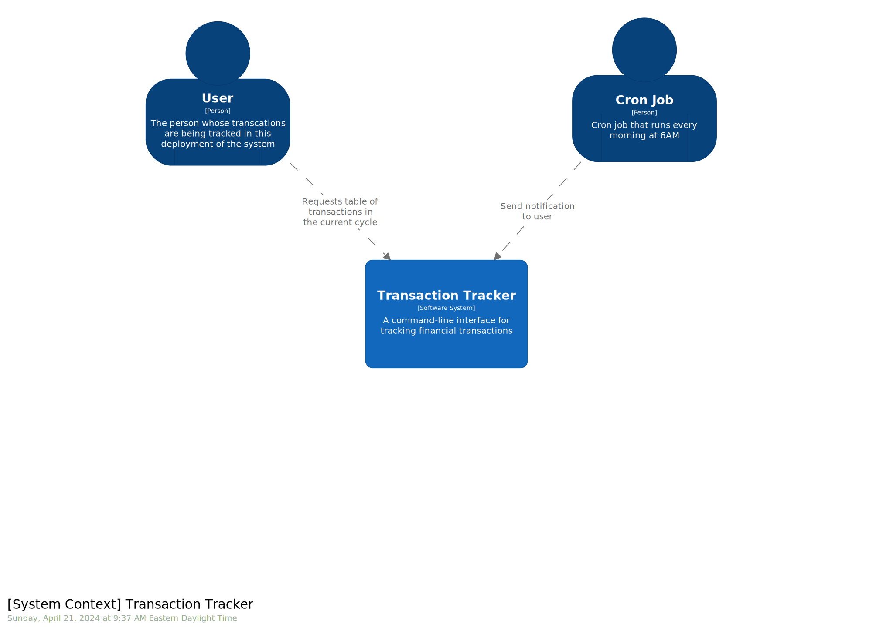

# Transaction Tracker

Web app & CLI tool that tracks user's payments across different banks. It leverages [Plaid](https://plaid.com/) to retrieve transactions from bank accounts, categorizes them, and displays them in a table.

Note that the application is currently customized to work with my TD, Amex, and Tangerine bank accounts. I am gradually working on generalizing it to work with any bank that is supported by Plaid.

## Usage

This tool is exposed as a web application and a CLI interface. The easier way to use it (how I usually use it) is through the web application. I started it as a CLI tool and since then moved to the web application. But I'm still maintaining the CLI.

Usage instructions:

- Sign up to [Plaid](https://plaid.com/) and obtain your credentials
- To use the web app:
  - Just run `docker-compose up -d`
  - Once it's loaded, go to _<http://localhost:3000/admin>_ to set up your credentials
  - Set up your plaid credentials (everything else is optional)
  - Click "Connect Bank" to connect your bank accounts [Still working on implementing this button]
  - Go to _<http://localhost:3000/>_ to see your transactions
- To use the CLI:
  - Set up the _.env_ based on [.env.sample](./.env.sample)
  - Run `yarn install`
  - Run `yarn ts-node ./src/index.ts help` for instructions. Also check out the [package.json scripts](./package.json#L3) for shortcuts

Note: To customize the date range for which transactions are displayed, the [`getCycleDates`](./src/lib/date-cycle-detector.ts) function can be modified.

### Optional Configuration Files

If the following files exist, the corresponding transactions inside them are ignored:

- _./db/[bankName].names_: contains a list of names, separated by newlines. If a transaction from `[bankName]` has a name matching one of the names in this file, the transaction is ignored. This is useful to ignore recurring transactions that have a consistent name.

## Architecture

Architecture visualizations using [Structurizr](https://docs.structurizr.com/) are found in the [docs](./docs/architecture/)

